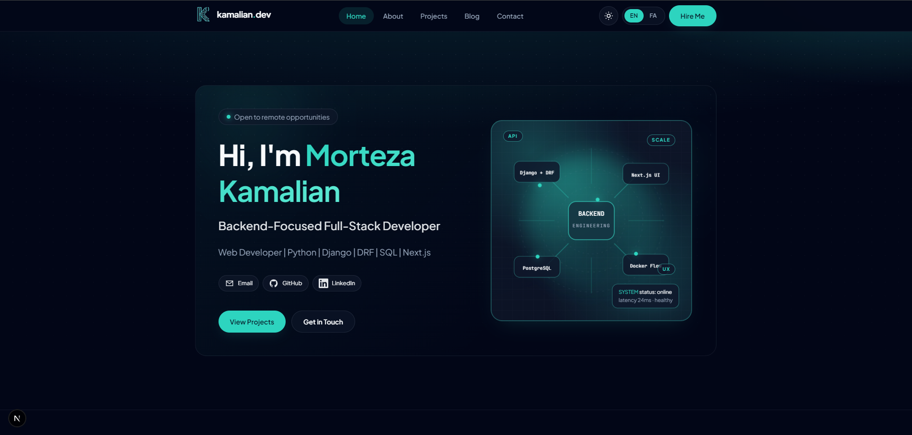
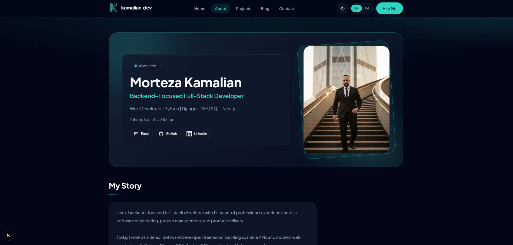
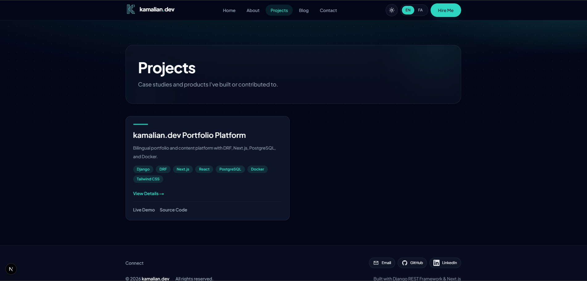
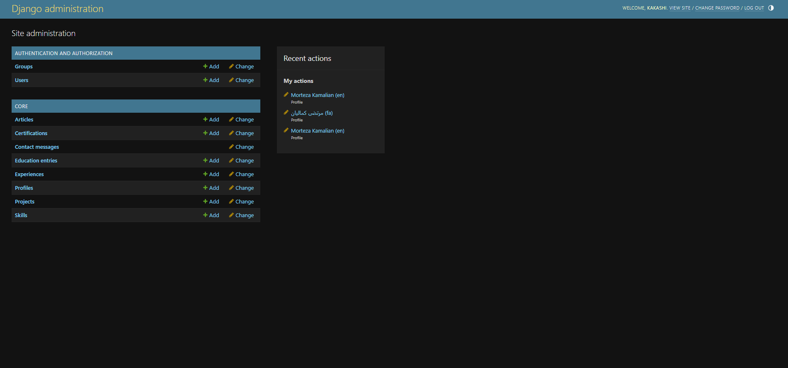

# kamalian.dev Portfolio

[](LICENSE)
[](https://www.djangoproject.com/)
[](https://nextjs.org/)
[](https://www.postgresql.org/)
[](https://www.docker.com/)

Bilingual (English / Persian) personal portfolio for **Morteza Kamalian** — a production-oriented full-stack project with Django REST Framework, Next.js App Router, PostgreSQL, Redis, and Docker.

**Live (target):** [https://kamalian.dev](https://kamalian.dev)  
**Repository:** [github.com/morteza708/portfolio](https://github.com/morteza708/portfolio)

---

## Highlights

- **Bilingual UI** — English (`/en`) and Persian (`/fa`) with RTL support via [next-intl](https://next-intl.dev/)
- **Admin-driven content** — Profile, skills, projects, blog, career data, and media managed from Django Admin
- **About page** — Avatar, bio, focus highlights, work timeline, education, and certifications (incl. Google Digital Marketing + SEO)
- **Performance** — Redis-backed API cache, Next.js ISR, and on-demand revalidation from Django signals
- **Media pipeline** — Auto-optimized cover images with generated thumbnails
- **Contact form** — Rate-limited API endpoint with field-level validation
- **SEO-ready** — Per-page metadata, Open Graph, JSON-LD, and locale-aware routing
- **Dockerized dev stack** — API, frontend, PostgreSQL, Redis, and optional Nginx reverse proxy

---

## Screenshots

| Home | About |
|------|-------|
|  |  |

| Projects | Admin |
|----------|-------|
|  |  |

---

## Architecture

```text
┌─────────────┐     ┌──────────────┐     ┌─────────────┐
│   Browser   │────▶│   Next.js    │────▶│  Django API │
│  /en  /fa   │     │  (ISR/cache) │     │    (DRF)    │
└─────────────┘     └──────┬───────┘     └──────┬──────┘
                           │                     │
                    on-demand revalidate    ┌────┴────┐
                           │                │         │
                           ▼                ▼         ▼
                    /api/revalidate    PostgreSQL   Redis
```

| Layer | Technology |
|-------|------------|
| Backend | Django 5 + Django REST Framework |
| Frontend | Next.js 16 + next-intl + Tailwind CSS 4 |
| Database | PostgreSQL 16 |
| Cache | Redis |
| Task queue | Celery (configured) |
| Reverse proxy | Nginx (optional Docker profile) |
| Rich text | CKEditor 5 (admin) |
| Fonts (EN) | Plus Jakarta Sans |
| Fonts (FA) | Iran Yekan (variable — not included; see setup) |

---

## Pages

| Route | Description |
|-------|-------------|
| `/[locale]` | Home — hero, activity summary, skills, featured projects, latest articles |
| `/[locale]/about` | About — profile photo, bio, highlights, experience timeline, education, certifications |
| `/[locale]/projects` | Project listing |
| `/[locale]/projects/[slug]` | Project detail |
| `/[locale]/blog` | Article listing |
| `/[locale]/blog/[slug]` | Article detail |
| `/[locale]/contact` | Contact form + social links |

---

## Quick Start

### Prerequisites

- [Docker](https://docs.docker.com/get-docker/) & Docker Compose
- Git

### 1. Clone & configure

```bash
git clone https://github.com/morteza708/portfolio.git
cd portfolio
cp .env.example .env
```

Generate strong secrets for production (never commit `.env`):

```bash
python3 -c "import secrets; print(secrets.token_urlsafe(64))"   # SECRET_KEY
python3 -c "import secrets, string; a=string.ascii_letters+string.digits+'!@#%^&*-_=+'; print(''.join(secrets.choice(a) for _ in range(32)))"  # POSTGRES_PASSWORD
```

### 2. Add Persian font (optional)

Copy your licensed Iran Yekan variable font to:

```text
frontend/public/fonts/iran-yekan/IranYekanXVF.woff2
```

Update the path in `frontend/src/app/globals.css` if your filename differs. Until added, Persian pages fall back to Tahoma.

### 3. Run with Docker

```bash
docker compose up --build
```

| Service | URL |
|---------|-----|
| Frontend | http://localhost:3000/en |
| API health | http://localhost:8000/api/v1/health/ |
| Django Admin | http://localhost:8000/admin/ |

Create a superuser:

```bash
docker compose exec api python manage.py createsuperuser
```

Seed bilingual sample content:

```bash
docker compose exec api python manage.py migrate
docker compose exec api python manage.py seed_data
```

Optional Nginx proxy on port 80:

```bash
docker compose --profile with-nginx up --build
```

### 4. Local development (without Docker)

**Backend**

```bash
cd backend
python -m venv .venv && source .venv/bin/activate
pip install -r requirements.txt
export DJANGO_SETTINGS_MODULE=config.settings.development
# Set POSTGRES_HOST=localhost in .env
python manage.py migrate
python manage.py runserver
```

**Frontend**

```bash
cd frontend
npm install
npm run dev
```

---

## Environment Variables

| Variable | Description | Example (dev) |
|----------|-------------|---------------|
| `SECRET_KEY` | Django secret key | _random 64+ chars_ |
| `DEBUG` | Debug mode | `1` |
| `DJANGO_SETTINGS_MODULE` | Settings module | `config.settings.development` |
| `ALLOWED_HOSTS` | Comma-separated hosts | `localhost,127.0.0.1,api` |
| `POSTGRES_*` | Database credentials | see `.env.example` |
| `REDIS_URL` | Redis connection | `redis://redis:6379/0` |
| `CORS_ALLOWED_ORIGINS` | Allowed frontend origins | `http://localhost:3000` |
| `NEXT_PUBLIC_API_URL` | Browser-facing API base | `http://localhost:8000/api/v1` |
| `NEXT_PUBLIC_SITE_URL` | Public site URL | `http://localhost:3000` |
| `API_INTERNAL_URL` | Server-side API (Docker) | `http://api:8000/api/v1` |
| `CACHE_TTL` | Redis cache TTL (seconds) | `3600` |
| `REVALIDATION_SECRET` | Next.js revalidation token | _random secret_ |
| `FRONTEND_REVALIDATE_URL` | Revalidation endpoint | `http://frontend:3000/api/revalidate` |

> **Docker note:** Next.js fetches the API on the server. Use `API_INTERNAL_URL` inside the frontend container and `NEXT_PUBLIC_API_URL` for the browser.

---

## API Endpoints

Base URL: `/api/v1`

```http
GET  /health/
GET  /{en|fa}/profile/
GET  /{en|fa}/skills/
GET  /{en|fa}/experiences/
GET  /{en|fa}/education/
GET  /{en|fa}/certifications/
GET  /{en|fa}/projects/
GET  /{en|fa}/projects/{slug}/
GET  /{en|fa}/articles/
GET  /{en|fa}/articles/{slug}/
POST /contact/
```

- API responses are cached in Redis (`CACHE_TTL`, default 1 hour).
- Saving content in Django Admin invalidates cache and triggers Next.js on-demand revalidation when `FRONTEND_REVALIDATE_URL` and `REVALIDATION_SECRET` are set.
- Uploaded cover images are auto-optimized to JPEG with a generated thumbnail (`cover_image_thumb`).

---

## Admin-Managed Content

| Model | Purpose |
|-------|---------|
| **Profile** | Name, bio, social links, hero CTAs, activity summary, **About page photo** (`avatar`), highlights |
| **Experience** | Work history timeline (bilingual) |
| **Education** | Degrees and institutions |
| **Certification** | Certificates (e.g. Google Digital Marketing, SEO skills) |
| **Skill** | Tech stack with proficiency |
| **Project** | Portfolio case studies |
| **Article** | Blog posts (CKEditor) |
| **ContactMessage** | Inbound contact form messages |

---

## Project Structure

```text
portfolio/
├── backend/                 # Django + DRF
│   ├── apps/core/           # Models, API, admin, cache, signals
│   └── config/settings/     # base, development, production
├── frontend/                # Next.js App Router
│   ├── src/app/[locale]/    # Localized pages
│   ├── src/components/      # UI components
│   └── src/messages/        # en.json, fa.json
├── nginx/                   # Reverse proxy config
├── docs/screenshots/        # README screenshots (optional)
├── docker-compose.yml
├── .env.example
└── LICENSE
```

---

## Deployment

Production deploy guide for **Runflare**: [docs/RUNFLARE.md](docs/RUNFLARE.md)

### Deployment Checklist (Phase 4)

- [ ] Create production `.env` on the server (never commit secrets)
- [ ] Set `DEBUG=0` and `DJANGO_SETTINGS_MODULE=config.settings.production`
- [ ] Configure domain DNS (`kamalian.dev`)
- [ ] Add `docker-compose.prod.yml` (Gunicorn + `next start` + Nginx + SSL)
- [ ] Run `migrate`, `collectstatic`, `createsuperuser`
- [ ] Persist PostgreSQL and `media/` volumes
- [ ] Re-upload or migrate media files (not tracked in Git)
- [ ] Enable HTTPS (Let's Encrypt or Cloudflare)
- [ ] Add analytics and uptime monitoring

---

## Roadmap

- [x] Phase 1 — MVP pages, i18n, Docker, core models
- [x] Phase 2 — Blog, admin content, SEO metadata
- [x] Phase 3 — ISR, Redis cache, image pipeline
- [x] About page redesign — career timeline, education, certifications
- [x] Phase 4 — Production deploy (Runflare) — see [docs/RUNFLARE.md](docs/RUNFLARE.md)
- [ ] Phase 5 — Analytics, Search Console, hire-me page
- [x] Phase 5 (partial) — `sitemap.xml`, `robots.txt`

---

## Author

**Morteza Kamalian**  
Backend-focused full-stack developer

- Website: [kamalian.dev](https://kamalian.dev)
- GitHub: [@morteza708](https://github.com/morteza708)
- LinkedIn: [morteza-kamalian](https://www.linkedin.com/in/morteza-kamalian-ab5a7b55)

---

## License

This project is licensed under the [MIT License](LICENSE).

---

<br>

# پورتفولیو kamalian.dev

[](LICENSE)

پورتفولیوی شخصی **مرتضی کمالیان** — دوزبانه (انگلیسی / فارسی) با Django REST Framework، Next.js، PostgreSQL، Redis و Docker.

**دامنه هدف:** [https://kamalian.dev](https://kamalian.dev)  
**مخزن گیت‌هاب:** [github.com/morteza708/portfolio](https://github.com/morteza708/portfolio)

---

## ویژگی‌ها

- **رابط دوزبانه** — مسیرهای `/en` و `/fa` با پشتیبانی RTL
- **مدیریت محتوا از ادمین** — پروفایل، مهارت‌ها، پروژه‌ها، بلاگ و سوابق شغلی
- **صفحه درباره من** — عکس، بیو، کارت‌های تمرکز، timeline کاری، تحصیلات و گواهینامه‌ها
- **عملکرد** — کش Redis، ISR در Next.js و revalidation خودکار از Django
- **بهینه‌سازی تصاویر** — فشرده‌سازی کاور و ساخت thumbnail
- **فرم تماس** — با rate limit و اعتبارسنجی
- **SEO** — متادیتا، Open Graph و JSON-LD
- **Docker** — محیط توسعه یکپارچه

---

## راه‌اندازی سریع

```bash
git clone https://github.com/morteza708/portfolio.git
cd portfolio
cp .env.example .env
docker compose up --build
```

سپس:

```bash
docker compose exec api python manage.py migrate
docker compose exec api python manage.py createsuperuser
docker compose exec api python manage.py seed_data
```

| سرویس | آدرس |
|--------|------|
| فرانت‌اند | http://localhost:3000/fa |
| API | http://localhost:8000/api/v1/health/ |
| ادمین | http://localhost:8000/admin/ |

### فونت فارسی

فایل فونت ایران‌یکان (با لایسنس معتبر) را در این مسیر قرار دهید:

```text
frontend/public/fonts/iran-yekan/IranYekanXVF.woff2
```

تا زمان افزودن فونت، از Tahoma به‌عنوان fallback استفاده می‌شود.

---

## API

```http
GET  /api/v1/{en|fa}/profile/
GET  /api/v1/{en|fa}/experiences/
GET  /api/v1/{en|fa}/education/
GET  /api/v1/{en|fa}/certifications/
GET  /api/v1/{en|fa}/skills/
GET  /api/v1/{en|fa}/projects/
GET  /api/v1/{en|fa}/articles/
POST /api/v1/contact/
```

جزئیات کامل در بخش انگلیسی بالا آمده است.

---

## اسکرین‌شات‌ها

| خانه | درباره من |
|------|-----------|
|  |  |

| پروژه‌ها | ادمین |
|---------|--------|
|  |  |

---

## نکات مهم

- فایل `.env` را **هرگز** commit نکنید.
- پوشه `media/` (عکس‌های آپلودشده) در Git نیست — در deploy باید جداگانه منتقل یا دوباره آپلود شود.
- برای production حتماً `SECRET_KEY`، پسورد دیتابیس و `REVALIDATION_SECRET` قوی تولید کنید.

---

## نقشه راه

- [x] فاز ۱ — صفحات اصلی، i18n، Docker
- [x] فاز ۲ — بلاگ، ادمین، SEO
- [x] فاز ۳ — ISR، کش Redis، تصاویر
- [x] بازطراحی صفحه درباره من
- [x] فاز ۴ — deploy تولید (Runflare) — [docs/RUNFLARE.md](docs/RUNFLARE.md)
- [ ] فاز ۵ — analytics، Search Console، صفحه hire-me
- [x] فاز ۵ (بخشی) — `sitemap.xml`، `robots.txt`

---

## مجوز

این پروژه تحت [مجوز MIT](LICENSE) منتشر شده است.

**مرتضی کمالیان** · [LinkedIn](https://www.linkedin.com/in/morteza-kamalian-ab5a7b55) · [GitHub](https://github.com/morteza708)
